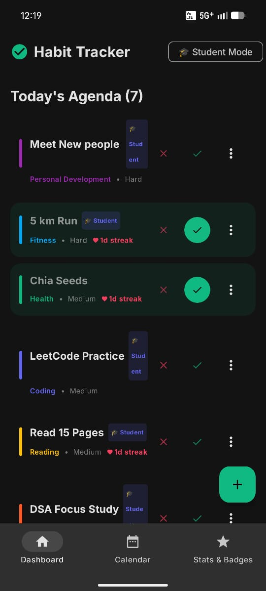
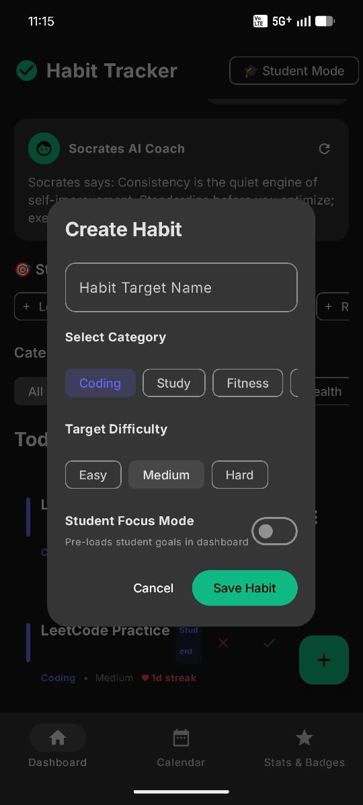
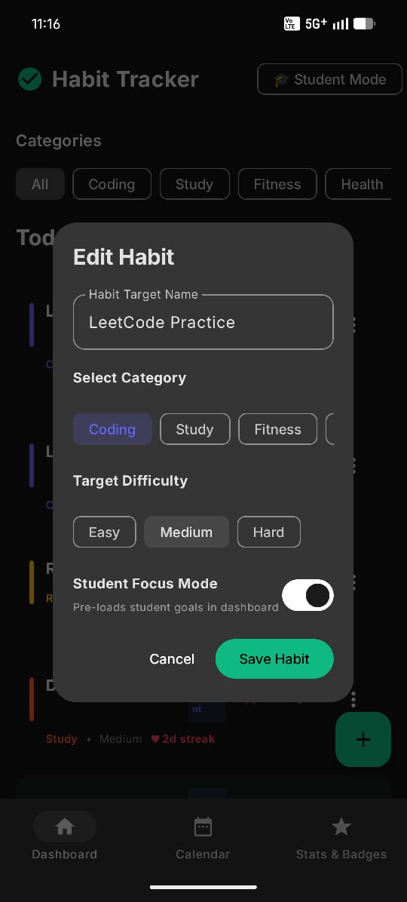
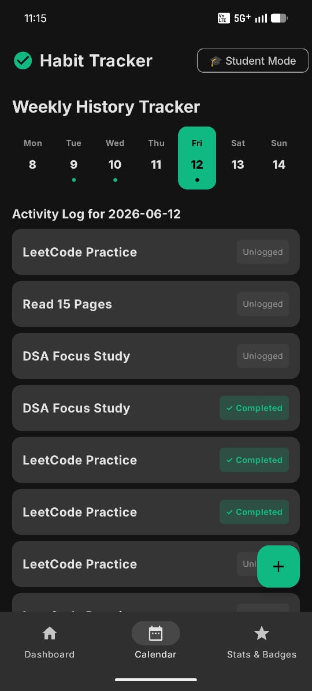
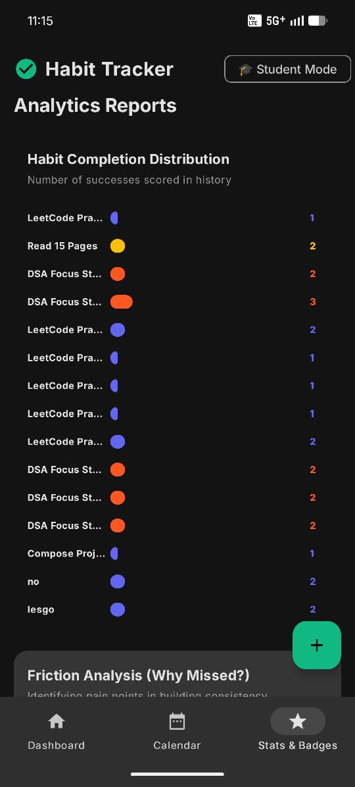
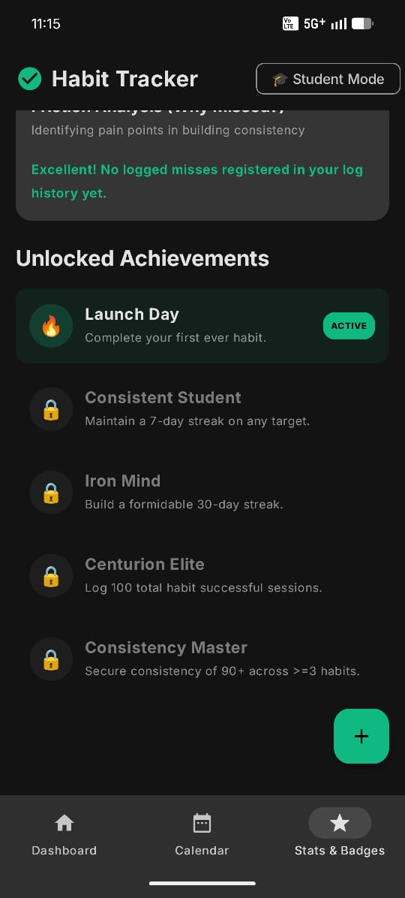

# Habit Tracker Android

A modern Android habit-tracking application designed to help students, programmers, and self-improvement enthusiasts build consistency through streak tracking, analytics, achievements, and AI-powered motivation.

## 📥 Download APK

👉 **Latest Release:**
https://github.com/Shourya-Sharma-4/habit-tracker-android/releases/latest

Download and install the latest APK directly from the Releases page.

---

## 🚀 Key Highlights

- Built entirely using Kotlin and Jetpack Compose
- AI-powered productivity coaching using Gemini API
- Habit streak tracking and consistency analytics
- Achievement and badge system
- Student-focused productivity presets
- Weekly history and activity logging
- Custom habit creation, editing, and management
- Modern Material Design UI

---

## 📖 Overview

Habit Tracker is a productivity-focused Android application that helps users build long-term consistency through data-driven habit tracking.

Instead of relying on motivation alone, the application focuses on creating systems that encourage daily action, accountability, and measurable progress.

The app combines traditional habit tracking with AI-powered guidance to help users maintain productive routines and improve consistency over time.

### Core Goals

- Build consistency through daily habit tracking
- Visualize progress using analytics
- Encourage accountability through streak systems
- Provide AI-generated productivity guidance
- Support student-focused study routines

---

## ✨ Features

### Habit Management

- Create custom habits
- Edit existing habits
- Delete habits
- Category-based organization
- Difficulty levels (Easy / Medium / Hard)
- Daily completion tracking

### Student Focus Mode

- Student-oriented productivity presets
- Quick setup for study routines
- Fast habit generation
- Productivity-focused workflow

### Streak Tracking

- Daily streak monitoring
- Consistency tracking
- Long-term progress visualization
- Completion history

### AI Productivity Coach

- Gemini-powered motivational coaching
- Habit-building recommendations
- Accountability-focused guidance
- Dynamic productivity insights

### Analytics Dashboard

- Habit completion statistics
- Success distribution reports
- Progress tracking
- Consistency analysis

### Achievement System

Unlock achievements including:

- 🔥 Launch Day
- 🎓 Consistent Student
- 🧠 Iron Mind
- 🏛️ Centurion Elite
- 👑 Consistency Master

### Calendar & History

- Weekly history tracker
- Daily activity logs
- Completion records
- Progress review system

### Friction Analysis

- Identifies missed habits
- Highlights consistency bottlenecks
- Encourages recovery after setbacks

### Never Miss Twice System

Inspired by modern habit-building principles:

- Detects missed days
- Highlights critical habits
- Encourages immediate recovery
- Reinforces consistency behavior

---

## 📸 Screenshots

### Dashboard
Main habit management screen with categories, streaks, and daily agenda.



---

### Create Habit
Create custom habits with category, difficulty, and student mode options.



---

### Edit Habit
Modify existing habits and update tracking preferences.



---

### Weekly History Tracker
Review activity history and completion records across the week.



---

### Analytics Dashboard
Track completion statistics, performance trends, and consistency metrics.



---

### Achievement System
Unlock milestones and track long-term progress.



## 🛠️ Tech Stack

### Language

- Kotlin

### UI

- Jetpack Compose
- Material Design 3

### Architecture

- Android Architecture Components
- State-Driven UI

### AI Integration

- Gemini API

### Storage

- Local Device Storage

---

## 🧩 Challenges Solved During Development

Some notable development challenges included:

- APK signing and keystore configuration
- Android build configuration issues
- Git and GitHub project setup
- Gemini API integration
- State management in Jetpack Compose
- Habit persistence and tracking logic
- Calendar history implementation
- Achievement tracking system
- Release APK generation and distribution

---

## 🔮 Future Improvements

Planned enhancements:

- Cloud synchronization
- User authentication
- Habit reminders and notifications
- Data export functionality
- Backup and restore support
- Cross-device synchronization
- Advanced analytics
- Habit sharing and accountability groups

---

## ⚙️ Installation

### 1. Clone the Repository

```bash
git clone https://github.com/YOUR_USERNAME/habit-tracker-android.git
```

### 2. Open in Android Studio

Open the project folder in Android Studio.

### 3. Create a `.env` File

Add your Gemini API key:

```env
GEMINI_API_KEY=YOUR_API_KEY
```

### 4. Build and Run

Run the application on:

- Android Emulator
- Physical Android Device

---

## 📈 Project Status

Active Development

This project continues to evolve with new features, UI improvements, performance optimizations, and productivity-focused enhancements.

---

## 👨‍💻 Author

**Shourya Sharma**

Computer Science Engineering Student

Focused on:

- Android Development
- Artificial Intelligence
- Machine Learning
- Productivity Systems
- Software Engineering

---

## ⭐ Support

If you found this project useful, consider giving it a star.

Feedback, suggestions, and contributions are always welcome.
